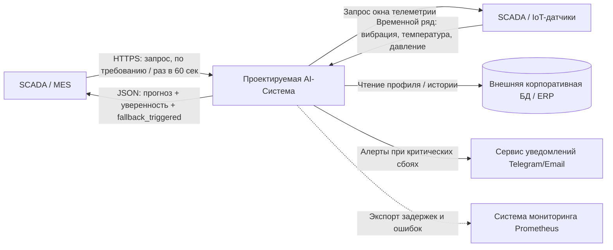
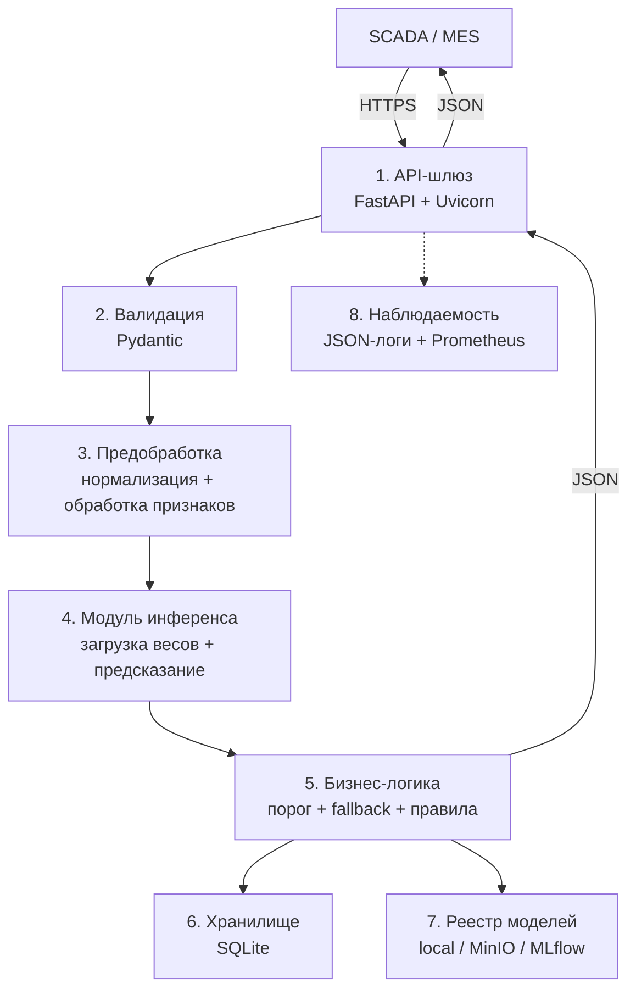

# Над лабораторной работали...

Гуль Эмиль, Галиакберов Динар, ЕТ-312

# AI-система предиктивного обслуживания оборудования (Predictive Maintenance)

Архитектурный отчет по лабораторной работе № 2 «Проектирование архитектуры программной AI-системы».

---

## 1. Бизнес-цель

Сервис решает проблему **слепых ремонтов**, когда оборудование обслуживается по графику, а не по фактическому состоянию. Система анализирует временные ряды телеметрии SCADA/IoT (вибрация, температура, давление) и определяет класс состояния оборудования: `normal`, `warning`, `failure`.

При высокой вероятности аварии информация о сбое передается в **SCADA/MES** для автоматической остановки или перевода оборудования в безопасный режим. При низкой уверенности модели (`confidence < 0.75`) решение принимается **автоматическим fallback-модулем** по консервативному правилу: выбирается класс с максимальным риском (`failure > warning > normal`).

**Конечный потребитель системы** — SCADA/MES. Оператор является только получателем уведомления о срабатывании fallback.

---

## 2. Метрики эффективности

### Метрики бизнес-процесса
- Сокращение времени аварийного простоя — на 15%.
- Сокращение времени реагирования на рост вероятности аварии — на 50%.
- Увеличение эффективности ремонтов — на 30%.

### Технические метрики (SLA)
- Время ответа сервиса — p95 ≤ 150 мс, p99 ≤ 200 мс.
- Пропускная способность — RPS ≥ 50.
- Доступность — 99.9%.

### Метрики качества модели
- macro-F1 ≥ 0.85
- recall(failure) ≥ 0.95
- ROC-AUC (OVR, macro) ≥ 0.92

---

## 3. Границы системы (Scope)

### Входит в систему
- Валидация данных
- Инференс
- Логирование
- API
- Генерация алертов
- Автоматический fallback при низкой уверенности
- Хранение артефактов модели
- Локальное хранение метаданных

### Не входит в систему
- Бухгалтерские проводки
- Физическое управление станками
- Юридическое утверждение приказов

---

## 4. Требования к системе

| Тип | Формулировка | Критерий приёмки |
|---|---|---|
| FR-01 | Приём данных через REST API | `POST /api/v1/predict` принимает JSON с `equipment_id` и диапазоном `from/to`; система сама запрашивает телеметрию и возвращает класс. |
| FR-02 | Валидация входных данных | При нарушении схемы — `400 Bad Request` с указанием поля. |
| FR-03 | Автоматический fallback | При `max(softmax) < 0.75` выбирается класс с максимальным риском (`failure > warning > normal`), в ответе выставляется `fallback_triggered = true`. Порог из конфига, версионируется с моделью. |
| NFR-01 | Производительность | Инференс одного окна (60×1 сек) ≤ 150 мс на CPU (p95), ≤ 200 мс (p99). |
| NFR-02 | Воспроизводимость | Ответ содержит `model_version` и `request_id`. |
| NFR-03 | Безопасность | Доступ по `X-API-Key`. |
| NFR-04 | Качество классификации | macro-F1 ≥ 0.85, recall по классу `failure` ≥ 0.95. |

---

## 5. Контекстная диаграмма (C4 Model — Level 1: System Context)



### Описание информационных потоков

**Поток 1. SCADA/MES → System (запрос на инференс)**

| Параметр | Значение |
|---|---|
| Протокол | HTTPS / REST |
| Частота | По требованию / по расписанию (раз в 60 сек, по границе окна) |
| Формат полезной нагрузки | JSON: `equipment_id`, `from`, `to`, `sensors` |

**Поток 2. System → SCADA/MES (прогноз + fallback)**

| Параметр | Значение |
|---|---|
| Протокол | HTTPS, JSON |
| Частота | Синхронно, в ответ на запрос |
| Формат полезной нагрузки | JSON: `predicted_class`, `confidence`, `top_k`, `fallback_triggered`, `model_version`, `request_id` |

**Поток 3. System → Sensors (запрос окна телеметрии)**

| Параметр | Значение |
|---|---|
| Протокол | OPC UA / MQTT / REST (зависит от SCADA) |
| Частота | На каждый запрос от SCADA/MES или по расписанию (раз в минуту на оборудование) |
| Формат полезной нагрузки | JSON: `equipment_id`, `from`, `to`, `sensors[]` |

**Поток 4. Sensors → System (данные с датчиков)**

| Параметр | Значение |
|---|---|
| Протокол | OPC UA / MQTT / REST |
| Частота | Синхронно в ответ; окно 60 сек, шаг 1 сек (60 точек на сенсор) |
| Формат полезной нагрузки | JSON: массив `{timestamp, sensor_id, vibration, temperature, pressure}` |

**Поток 5. System → CorpDB (обращение к базе данных)**

| Параметр | Значение |
|---|---|
| Протокол | JDBC / ODBC / REST (зависит от ERP) |
| Частота | При первом обращении к оборудованию + кэш с TTL 1 час |
| Формат полезной нагрузки | SQL-запрос / GET-запрос по `equipment_id` |

**Поток 6. System → AlertSystem (алерты)**

| Параметр | Значение |
|---|---|
| Протокол | HTTPS (Telegram Bot API) / SMTP (Email) |
| Частота | Событийно — только при `predicted_class = warning` или `failure` |
| Формат полезной нагрузки | JSON: `equipment_id`, `predicted_class`, `confidence`, `timestamp` |

**Поток 7. System → Monitoring (метрики)**

| Параметр | Значение |
|---|---|
| Протокол | HTTP pull, Prometheus scrape `/metrics` |
| Частота | Каждые 15 секунд |
| Формат полезной нагрузки | text (OpenMetrics) |

---

## 6. Компонентная декомпозиция (C4 Model — Level 2: Container / Component)



### Модули системы

| № | Модуль | Технологии | Ответственность |
|---|---|---|---|
| 1 | API Gateway | FastAPI + Uvicorn | точка входа, маршрутизация, auth |
| 2 | Validation | Pydantic | схема JSON, типы, диапазоны |
| 3 | Preprocessing | pandas, sklearn | окна, нормализация, признаки |
| 4 | Inference Engine | PyTorch / sklearn | загрузка весов, softmax, класс |
| 5 | Business Logic | Python | порог 0.75, автоматический fallback, правила, алерты |
| 6 | Storage | SQLite | лог инференса, аудит |
| 7 | Model Registry | local / MinIO / MLflow | веса, скейлеры, `model_config.yaml` |
| 8 | Observability | logging + prometheus_client | JSON-логи, `/metrics` |

### Таблица компонентов

| Компонент | Назначение модуля | Входные данные | Выходные данные | Используемые библиотеки |
|---|---|---|---|---|
| `app.api.routes` | Обработка HTTP-запросов, маршрутизация, аутентификация | HTTP-запрос | HTTP-ответ | fastapi, starlette, uvicorn |
| `app.api.schemas` | Pydantic-схемы валидации вход/выход | Сырые данные JSON | Строго типизированный объект (`PredictRequest` / `PredictResponse`) | pydantic |
| `app.ml.preprocessing` | Трансформация признаков: окна, нормализация, извлечение | Словарь признаков (телеметрия) | NumPy array / Tensor | numpy, pandas, scikit-learn |
| `app.ml.inference` | Исполнение инференса модели, softmax | Подготовленные фичи | Числовое предсказание, вероятности классов | onnxruntime, torch, joblib |
| `app.services.prediction` | Оркестрация: порог 0.75, автоматический fallback, бизнес-правила | Сырой запрос, вердикт модели | Готовый бизнес-результат (`predicted_class`, `fallback_triggered`) | Чистый Python |
| `app.repositories` | Персистентность фактов прогноза и алертов | Сущность прогноза | Запись в БД | sqlalchemy, aiosqlite |

---

## 7. Спецификация контрактов REST API

### 7.1. Главный эндпоинт инференса: POST /api/v1/predict

**Заголовки:**

```
Content-Type: application/json
X-API-Key: <secret_token>
```

**Схема входных данных (Pydantic):**

```python
from pydantic import BaseModel, Field
from uuid import UUID
from datetime import datetime
from typing import List

class PredictRequest(BaseModel):
    request_id: UUID = Field(description="Уникальный идентификатор запроса (UUIDv4)")
    equipment_id: str = Field(description="Идентификатор единицы оборудования")
    from_ts: datetime = Field(description="Начало окна телеметрии")
    to_ts: datetime = Field(description="Конец окна телеметрии")
    sensors: List[str] = Field(
        default=["vibration", "temperature", "pressure"],
        description="Список сенсоров для запроса"
    )

    model_config = {
        "json_schema_extra": {
            "example": {
                "request_id": "9b1deb4d-3b7d-4bad-9bdd-2b0d7b3dcb6d",
                "equipment_id": "PUMP_UNIT_42",
                "from_ts": "2026-09-28T10:00:00Z",
                "to_ts": "2026-09-28T10:01:00Z",
                "sensors": ["vibration", "temperature", "pressure"]
            }
        }
    }
```

**Схема успешного ответа (200 OK):**

```python
class TopKItem(BaseModel):
    cls: str
    prob: float

class PredictResponse(BaseModel):
    request_id: str = Field(description="UUID запроса для аудита")
    equipment_id: str = Field(description="Идентификатор оборудования")
    predicted_class: str = Field(description="normal | warning | failure")
    confidence: float = Field(ge=0.0, le=1.0, description="max(softmax)")
    top_k: List[TopKItem] = Field(description="Топ-3 класса с вероятностями")
    fallback_triggered: bool = Field(description="true, если confidence < 0.75")
    model_version: str = Field(description="Семантическая версия модели")
```

**Пример тела успешного ответа:**

```json
{
  "request_id": "9b1deb4d-3b7d-4bad-9bdd-2b0d7b3dcb6d",
  "equipment_id": "PUMP_UNIT_42",
  "predicted_class": "failure",
  "confidence": 0.68,
  "top_k": [
    {"cls": "failure", "prob": 0.68},
    {"cls": "warning", "prob": 0.24},
    {"cls": "normal",  "prob": 0.08}
  ],
  "fallback_triggered": true,
  "model_version": "1.3.0"
}
```

**Спецификация ошибок валидации (400 Bad Request):**

```json
{
  "error": "VALIDATION_FAILED",
  "detail": [
    {
      "field": "from_ts",
      "message": "Value must be earlier than to_ts"
    }
  ]
}
```

### 7.2. Системные эндпоинты

**GET /api/v1/health** — проверка состояния сервиса:

```json
{
  "status": "healthy",
  "model_loaded": true,
  "model_version": "1.3.0",
  "uptime_seconds": 3600
}
```

**GET /metrics** — выдача метрик для Prometheus в формате OpenMetrics:

```
inference_latency_ms{quantile="0.95"} 138
requests_total{endpoint="/predict"} 1024
errors_total{endpoint="/predict"} 3
fallback_rate 0.12
```

---

## 8. Архитектурные решения (ADR)

### ADR-01: Выбор режима инференса (Synchronous REST API vs Asynchronous Message Queue)

- **Статус:** Принято (Accepted)
- **Контекст:** система работает с окнами телеметрии по запросу от SCADA/MES. Требуется ответ в пределах SLA (p95 ≤ 150 мс), запросы поступают одиночными окнами, а не пакетами.
- **Рассмотренные альтернативы:**
  1. Синхронный REST API (FastAPI).
  2. Асинхронная очередь (Kafka / RabbitMQ) с callback-нотификацией.
- **Решение:** синхронный REST API.
- **Обоснование:** низкая задержка при одиночных запросах, простота реализации и отладки, отсутствие необходимости в брокере сообщений на первом этапе.
- **Последствия:**
  - (+) минимальная latency, простая наблюдаемость.
  - (–) нет встроенной буферизации при пиковых нагрузках; при росте RPS потребуется перейти к событийной модели.

### ADR-02: Стратегия хранения и версионирования моделей и артефактов

- **Статус:** Принято (Accepted)
- **Контекст:** веса модели, скейлеры и `model_config.yaml` должны быть версионированы и воспроизводимы (NFR-02). Бинарные артефакты нельзя хранить в Git.
- **Рассмотренные альтернативы:**
  1. Хранение бинарных весов прямо в Git-репозитории.
  2. Локальный каталог `models/<version>/`.
  3. Внешний реестр моделей (S3 MinIO / MLflow).
- **Решение:** локальный каталог `models/<version>/` для dev; S3 MinIO / MLflow — для prod. В Git попадают только метаданные (DVC-указатели, конфиги).
- **Обоснование:** исключает раздувание репозитория, обеспечивает версионирование артефактов, совместимо с DVC.
- **Последствия:**
  - (+) чистый Git, воспроизводимость инференса.
  - (–) требуется настроить DVC / MinIO в CI.

### ADR-03: Архитектурный стиль сервиса (Модульный монолит vs Микросервисы)

- **Статус:** Принято (Accepted)
- **Контекст:** один разработчик, нагрузка ≤ 50 RPS, инференс на CPU, отсутствие GPU.
- **Рассмотренные альтернативы:**
  1. Модульный монолит в едином Docker-контейнере.
  2. Микросервисы (API Gateway + отдельный сервис инференса + брокер).
- **Решение:** модульный монолит.
- **Обоснование:** отсутствие сетевых задержек, простота локальной отладки, единый цикл релизов, минимальные эксплуатационные расходы на первом этапе.
- **Последствия:**
  - (+) быстрая разработка, простое тестирование.
  - (–) при росте нагрузки потребуется выделить Inference Engine в отдельный сервис.

---

## 9. Безопасность, наблюдаемость и устойчивость

### 9.1. Информационная безопасность и защита данных

- **Аутентификация внешних вызовов:** статический токен в заголовке `X-API-Key`. При неверном/отсутствующем ключе — `401 Unauthorized`. Ротация ключа — вручную через конфиг, версионируется вместе с деплоем.
- **Защита от DoS/DDoS:**
  - Payload Size Limit ≤ 2 Мб (настраивается в Uvicorn / FastAPI);
  - тайм-аут запроса ≤ 5 сек;
  - rate limiting по IP/API-Key (например, 10 RPS на ключ).
- **Соблюдение 152-ФЗ:**
  - персональные данные (ФИО, телефоны, паспортные данные) в систему **не поступают** — только `equipment_id` и технические параметры;
  - идентификаторы оборудования маскируются перед логированием;
  - передача — только по HTTPS.

### 9.2. Наблюдаемость (Observability) и аудит

**Формат логов:** структурированное JSON-логирование каждого входящего запроса:

```json
{
  "timestamp": "2026-09-28T12:00:00Z",
  "level": "INFO",
  "request_id": "9b1deb4d-3b7d-4bad-9bdd-2b0d7b3dcb6d",
  "equipment_id": "PUMP_UNIT_42",
  "latency_ms": 12.4,
  "status": 200,
  "predicted_class": "warning",
  "confidence": 0.68,
  "fallback_triggered": false,
  "model_version": "1.3.0"
}
```

**Метрики сервиса (Prometheus):**
- `http_requests_total` — счётчик запросов по кодам ответа;
- `http_request_duration_seconds` — гистограмма задержек;
- `model_inference_duration_seconds` — чистое время инференса;
- `fallback_rate` — доля запросов, ушедших в автоматический fallback.

**Контроль дрейфа данных (Data & Concept Drift):**
- сбор логов входящих векторов признаков;
- периодический offline-анализ (Evidently) — тесты Колмогорова-Смирнова, Population Stability Index (PSI);
- при PSI > 0.2 — алерт в Prometheus и сигнал на дообучение.

### 9.3. Устойчивость и деградация

- При недоступности SCADA/IoT — повторный запрос с exponential backoff (до 3 попыток), при неудаче — `503 Service Unavailable` с `request_id` для трассировки.
- При недоступности Model Registry — сервис продолжает работать на последней загруженной в память версии модели.
- При `fallback_triggered = true` решение принимается автоматически по правилу риска `failure > warning > normal`; результат помечается в аудит-логе.

---

## 10. Структура репозитория

```
ai-system-predictive-maintenance/
├── .gitignore              # Исключения Git (кэш, venv, веса моделей)
├── LICENSE                 # MIT License
├── README.md               # Архитектурный отчет (разделы 1–10)
├── app/
│   ├── api/                # Pydantic-схемы и роуты
│   │   ├── schemas.py
│   │   └── routes.py
│   ├── core/               # Конфигурация и логирование
│   ├── data/               # Загрузка и валидация телеметрии
│   ├── ml/                 # ModelLoader, preprocessing, inference
│   ├── services/           # Бизнес-логика (порог, fallback, правила)
│   ├── repositories/       # Слой персистентности (SQLite)
│   └── main.py             # Точка входа FastAPI
├── docs/
│   ├── architecture.md
│   └── adr/
│       ├── ADR-01-sync-vs-async.md
│       ├── ADR-02-model-registry.md
│       └── ADR-03-monolith-vs-microservices.md
├── models/                 # Артефакты модели (в .gitignore)
└── tests/
